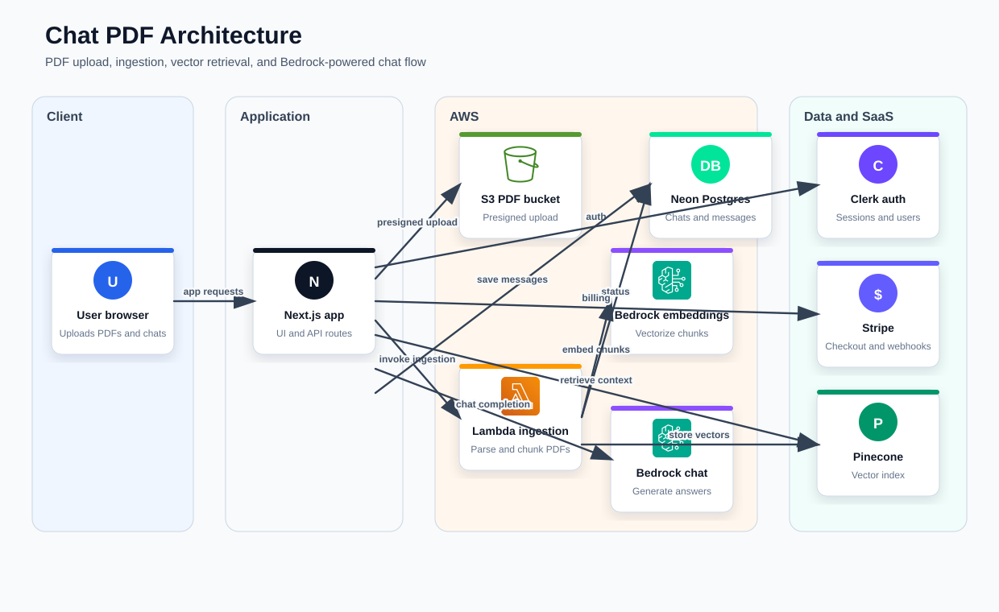

## Project Overview

This project is a web application that allows users to interact with PDF documents using chat-based features. It leverages modern web technologies and integrates with several third-party services for authentication, storage, and AI-powered functionalities.

## Features

- User authentication and authorization
- Upload and manage PDF documents
- Chat interface for querying PDF content
- AI-powered responses with Amazon Bedrock
- Secure file storage using S3-compatible services
- Payment processing with Stripe

## Architecture



Regenerate the diagram with `pnpm generate:architecture`.

## Technologies Used

- Next.js
- Clerk (Authentication)
- AWS S3
- Pinecone (Vector database)
- Amazon Bedrock
- Stripe (Payments)
- NeonDB

## Setup Instructions

1. Clone the repository.
2. Install dependencies with `pnpm install`.
3. Configure the required environment variables as shown above.
4. Run the development server with `pnpm dev`.
5. Open [http://localhost:3000](http://localhost:3000) in your browser.

## Environment Variables

To run this project, you will need to add the following environment variables to your `.env` file:

```plaintext
# Client (Public)
NEXT_PUBLIC_CLERK_PUBLISHABLE_KEY=
NEXT_PUBLIC_CLERK_SIGN_IN_URL=/sign-in
NEXT_PUBLIC_CLERK_SIGN_UP_URL=/sign-up
NEXT_PUBLIC_CLERK_AFTER_SIGN_IN_URL=/
NEXT_PUBLIC_CLERK_AFTER_SIGN_UP_URL=/
NEXT_PUBLIC_S3_BUCKET_NAME=

# Server (Private)
NEXT_BASE_URL=http://localhost:3000
DATABASE_URL=
CLERK_SECRET_KEY=
AWS_REGION=
AWS_ACCESS_KEY_ID=
AWS_SECRET_ACCESS_KEY=
PINECONE_ENVIRONMENT=
PINECONE_API_KEY=
BEDROCK_EMBEDDING_MODEL_ID=amazon.titan-embed-text-v1
BEDROCK_CHAT_MODEL_ID=us.amazon.nova-lite-v1:0
AWS_INGESTION_LAMBDA_NAME=
STRIPE_SECRET_KEY=
STRIPE_WEBHOOK_SECRET=
SENTRY_AUTH_TOKEN=
```
